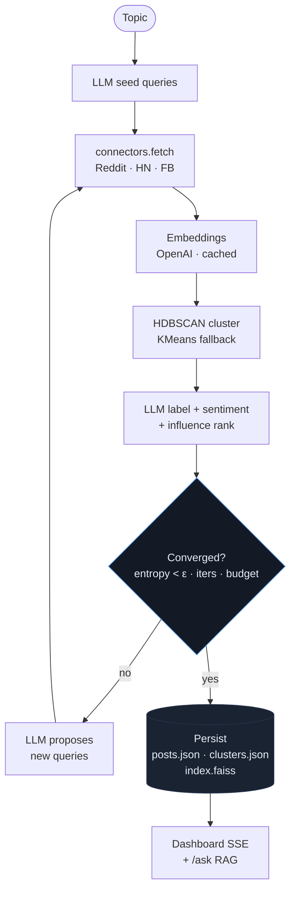

# PulseTrace

> **Turn the noise of social media into the signal your decisions need.**

PulseTrace is an AI-powered sentiment intelligence platform that autonomously researches any topic across social media, organizes the chatter into themes, ranks the loudest voices, and lets you ask questions of the gathered corpus in plain language.

Give it a topic. An LLM-driven agent generates search queries, pulls posts from multiple sources, embeds and clusters them, names each theme, scores sentiment, and iterates until coverage converges. The dashboard streams the work live.

---

## Table of contents

- [Features](#features)
- [How it works](#how-it-works)
- [Architecture](#architecture)
- [Source reliability](#source-reliability)
- [Quick start](#quick-start)
- [Configuration](#configuration)
- [Using the dashboard](#using-the-dashboard)
- [HTTP API](#http-api)
- [CLI (legacy v1)](#cli-legacy-v1)
- [Project layout](#project-layout)
- [Development](#development)
- [Testing](#testing)
- [Roadmap](#roadmap)
- [Limitations](#limitations)

---

## Features

- **Agentic research loop.** An LLM plans seed queries, inspects what came back, and proposes new queries to fill coverage gaps. Stops on entropy convergence, iteration budget, or LLM signal.
- **Multi-source ingestion.** Pluggable connectors for **Reddit**, **Hacker News**, **Facebook**, **Twitter / X**, and **Instagram**. Reliability varies dramatically — see [Source reliability](#source-reliability).
- **Embedding-based topic discovery.** OpenAI `text-embedding-3-small` + HDBSCAN clustering (KMeans fallback). On-disk JSONL cache makes re-runs free.
- **Per-cluster sentiment.** Batched LLM classification, aggregated to positive / neutral / negative ratios.
- **Influence ranking.** Engagement + recency-decayed score surfaces the posts that actually moved the needle in each cluster.
- **RAG Q&A.** FAISS index per run; ask follow-ups against the gathered corpus and get cited answers.
- **Live SSE dashboard.** Topic graph (Cytoscape), sentiment chart (Chart.js), streaming progress log, ask-box. No build step.

---

## How it works



Stop conditions: `MAX_ITERS = 4`, `MAX_POSTS = 500`, entropy delta `< 0.05`, or LLM-signaled stop.

---

## Architecture

| Layer | Module | Responsibility |
|---|---|---|
| Sources | `lib/connectors/{base,reddit,hn,facebook,x,instagram}.py` | Fetch normalized `Post` records for a query |
| Embedding | `lib/embed.py` | Cached OpenAI embeddings (SHA1-keyed JSONL) |
| Clustering | `lib/cluster.py` | HDBSCAN with KMeans fallback, centroids, entropy |
| LLM | `lib/llm.py` | Strict-JSON chat wrapper with one retry |
| Labels & stance | `lib/label.py`, `lib/stance.py` | Name clusters, score sentiment per post |
| Scoring | `lib/influence.py` | Engagement + recency-decay influence |
| Agent | `lib/agent.py` | Orchestrator: seed -> fetch -> cluster -> expand/stop |
| RAG | `lib/rag.py` | FAISS index + cited-answer endpoint |
| Realtime | `lib/events.py` | Thread-safe per-run SSE pub/sub |
| Storage | `lib/store.py` | Per-run JSON files under `data/runs/<run_id>/` |
| Server | `server.py` | Flask app + SSE |
| UI | `templates/index.html` | Single-page dashboard (CDN libs, no build) |

---

## Source reliability

Honest accounting. **Reddit and HN are the only sources you can trust without setup.**
Everything else is best-effort and will return empty lists on failure rather than crash.

| Source | Status | Auth | Failure mode |
|---|---|---|---|
| **Reddit** | reliable | `REDDIT_CLIENT_ID` + `REDDIT_CLIENT_SECRET` | rare rate-limit |
| **Hacker News** | reliable | none | none |
| **Facebook** | fragile (main target) | `info/cookies.json` from logged-in session | DOM drift, expired cookies, account flags |
| **Twitter / X** | fragile, awaiting creds | `info/x_cookies.json` or `X_USERNAME`/`X_PASSWORD`/`X_EMAIL` | unofficial endpoints, suspension risk |
| **Instagram** | fragile, awaiting creds | `info/ig_session_<user>` or `IG_USERNAME`/`IG_PASSWORD` | rate-limits, session bans |

### What you should know before enabling FB / X / IG

- **Use a throwaway account.** Facebook, X, and Instagram all flag and disable
  accounts that look automated. Do not point this at your main account.
- **Cookies / sessions go stale silently.** When a connector starts returning
  empty results without errors, the auth is the first thing to check.
- **DOM and endpoint drift.** The Facebook connector scrapes `[role="article"]`
  nodes. The X connector uses unofficial endpoints via `twikit`. Both platforms
  rotate these regularly; expect breakage every few weeks.
- **Rate limits are real and unforgiving.** Especially Instagram. Cap your runs
  and don't loop the same query.
- **Graceful failure.** Every connector catches its own exceptions and returns
  `[]`. The agent loop treats low recall as a signal to retry on remaining
  working sources, so a broken source never kills a run.
- **Twitter/X and Instagram are not live-tested in this repo.** Skeletons are
  wired in. They will fire the moment you supply credentials. Until then they
  return `[]` and the UI toggles are off by default.

Full detail and mitigations in [`.claude/memory/source-risks.md`](.claude/memory/source-risks.md).

---

## Quick start

### Prereqs

- Python 3.10+
- An OpenAI API key
- Reddit application credentials (script-type app, free at https://www.reddit.com/prefs/apps)

### Install

```bash
git clone https://github.com/abrr-fhyz/PulseTrace.git
cd PulseTrace
git checkout shyan

python3 -m venv .venv
.venv/bin/pip install -r requirements.txt
```

### Configure

```bash
cp .env.example .env
# edit .env and fill in your keys
```

### Run

```bash
.venv/bin/python server.py
```

Open <http://localhost:5000>.

---

## Configuration

All configuration lives in `.env`. See `.env.example` for the full list.

| Variable | Required | Purpose |
|---|---|---|
| `OPENAI_API_KEY` | yes | Embeddings + LLM calls |
| `REDDIT_CLIENT_ID` | for Reddit source | PRAW auth |
| `REDDIT_CLIENT_SECRET` | for Reddit source | PRAW auth |
| `REDDIT_USER_AGENT` | optional | Defaults to `pulsetrace/0.2` |
| `PULSETRACE_LLM_MODEL` | optional | Defaults to `gpt-4o-mini` |
| `FACEBOOK_EMAIL` / `FACEBOOK_PASSWORD` | only for legacy v1 scraper | v1 path |
| `X_USERNAME` / `X_PASSWORD` / `X_EMAIL` | for X source | optional — see Source reliability |
| `IG_USERNAME` / `IG_PASSWORD` | for Instagram source | optional — see Source reliability |

Session files (preferred over username/password where available):
- Facebook: `info/cookies.json`
- Twitter/X: `info/x_cookies.json`
- Instagram: `info/ig_session_<username>` (instaloader format)

Tunable constants live near the top of `lib/agent.py`: `MAX_ITERS`, `MAX_POSTS`, `EPS`.

---

## Using the dashboard

1. Enter a topic in the **Run** panel (e.g. `OpenAI Codex`, `Bangladesh election`, `Rust async`).
2. Toggle which sources to use (Reddit + HN by default).
3. Click **Start agent**.
4. Watch the live log on the left. Posts, clusters, and entropy update as the agent iterates.
5. When the run finishes, the **Topic graph** renders (clusters as nodes, similarity as edges), the **Sentiment by cluster** chart fills in, and the **Clusters** list shows themes with positive / neutral / negative bars.
6. Use **Ask the corpus** to ask follow-up questions. Answers cite the post ids they used.

Legacy v1 buttons (Scrape FB, Process, Summarize) live under the **Legacy v1 tools** collapsible.

---

## HTTP API

| Method | Path | Body / Query | Returns |
|---|---|---|---|
| `POST` | `/run` | `{"topic": "...", "sources": ["reddit","hn"]}` | `{"run_id": "..."}` |
| `GET` | `/events?run_id=` | - | `text/event-stream` of agent events |
| `GET` | `/graph?run_id=` | - | `{nodes, edges}` for Cytoscape |
| `POST` | `/ask` | `{"run_id": "...", "q": "..."}` | `{answer, citations, retrieved}` |
| `GET` | `/run-info?run_id=` | - | `{run, clusters, posts}` |
| `GET` | `/status` | - | (legacy v1) screenshot + json counts |
| `POST` | `/run-command` | `{"command": "scrape\|process\|summarize"}` | (legacy v1) |

### SSE event types

`open`, `started`, `seeded`, `iter_start`, `posts_fetched`, `clustered`, `labeled`, `low_recall`, `embed_error`, `done`, `_close`.

### Example

```bash
curl -s -X POST http://localhost:5000/run \
  -H 'content-type: application/json' \
  -d '{"topic":"openai codex","sources":["reddit","hn"]}'
# -> {"run_id":"1717000000-abcd12"}

curl -N "http://localhost:5000/events?run_id=1717000000-abcd12"

curl -s -X POST http://localhost:5000/ask \
  -H 'content-type: application/json' \
  -d '{"run_id":"1717000000-abcd12","q":"who is most critical?"}'
```

---

## CLI (legacy v1)

The original Facebook scraper pipeline is preserved:

```bash
python main.py scrape --target 50 --headless
python main.py process
python main.py summarize
```

Cookies live in `info/cookies.json`. Screenshots are written to `screenshots/`. JSON output goes to `data/`.

---

## Project layout

```
.
├── CLAUDE.md                # project memory for Claude Code
├── README.md                # this file
├── .env.example
├── requirements.txt
├── main.py                  # v1 CLI dispatcher
├── server.py                # Flask + SSE
├── templates/
│   └── index.html           # dashboard
├── lib/
│   ├── connectors/
│   │   ├── base.py          # Connector ABC + Post dataclass
│   │   ├── reddit.py
│   │   └── hn.py
│   ├── embed.py             # cached OpenAI embeddings
│   ├── cluster.py           # HDBSCAN + KMeans fallback
│   ├── llm.py               # strict-JSON chat wrapper
│   ├── label.py             # cluster naming
│   ├── stance.py            # per-cluster sentiment
│   ├── influence.py         # engagement + recency scoring
│   ├── events.py            # SSE pub/sub
│   ├── store.py             # per-run JSON files
│   ├── agent.py             # orchestrator loop
│   ├── rag.py               # FAISS + cited Q&A
│   └── scrape.py, scraper.py, process.py, summarizer.py, summary.py  # v1 FB pipeline
├── tests/                   # pytest suite
├── data/runs/<run_id>/      # posts.json, clusters.json, run.json, index.faiss
└── .claude/
    ├── memory/              # project context, decision log
    ├── plans/               # implementation plans
    ├── specs/               # design specs
    ├── rules/               # coding standards
    └── skills/              # local project skills
```

---

## Development

Spec: [`.claude/specs/2026-05-29-pulsetrace-v2-design.md`](.claude/specs/2026-05-29-pulsetrace-v2-design.md)
Plan: [`.claude/plans/2026-05-29-pulsetrace-v2.md`](.claude/plans/2026-05-29-pulsetrace-v2.md)
Standards: [`.claude/rules/coding-standards.md`](.claude/rules/coding-standards.md)

Adding a new source:

1. Create `lib/connectors/<name>.py` with a class subclassing `Connector` (see `base.py`).
2. Implement `fetch(query, limit) -> list[Post]`.
3. Register it in `lib/agent.py:SOURCES`.
4. Add a tickbox in `templates/index.html`.
5. Write a unit test mocking the underlying API.

---

## Testing

Default suite (fully mocked, no external calls):
```bash
.venv/bin/python -m pytest -v
```

`slow` tests (live external calls) are skipped by default. They cover:

- Live Ollama backend (`tests/test_ollama_backend.py`)
- Real Facebook Playwright scrape (`tests/test_fb_integration.py`)
- Full FB + Ollama end-to-end pipeline (`tests/test_agent_e2e_fb_ollama.py`)

Setup, env vars, troubleshooting: see [`.claude/memory/testing-with-ollama.md`](.claude/memory/testing-with-ollama.md).

Quick local-only run with Ollama + FB cookies in place:
```bash
export PULSETRACE_BACKEND=ollama
export FB_INTEGRATION=1
.venv/bin/python -m pytest -v -m "slow or not slow"
```

---

## Roadmap

- Stance/disagreement graph (which clusters argue with which).
- Cross-run trend lines (track a topic over time).
- Mastodon + Bluesky connectors.
- Per-cluster timeline chart.
- Briefing export (Markdown + PDF).

---

## Limitations

- **Facebook, X, and Instagram scraping is fragile.** See [Source reliability](#source-reliability) — these connectors are real attempts, not stubs, but they depend on cookies / sessions and on platform DOMs / endpoints that change without warning. Reddit + HN are the only sources that work out of the box.
- **Twitter/X and Instagram are not live-tested.** Skeletons wired in and ready to fire on creds. No guarantees they survive their first real run without selector tweaks.
- **Risk of account suspension.** All three closed platforms detect automation. Use throwaway accounts.
- **No durable storage.** Runs are JSON files on disk. Wipe `data/runs/` to reset.
- **OpenAI cost.** Hard-capped at 500 posts per run; the embedding cache reuses prior work. A typical run is a few cents.
- **No auth.** The Flask server is for local use. Do not expose it to the internet without adding an auth layer.
- **English-leaning.** The agent's seed queries and clustering work in any language, but the LLM labels / stance are most reliable in English.

---

## License

MIT. See `LICENSE` if present, otherwise treat as MIT until specified.
